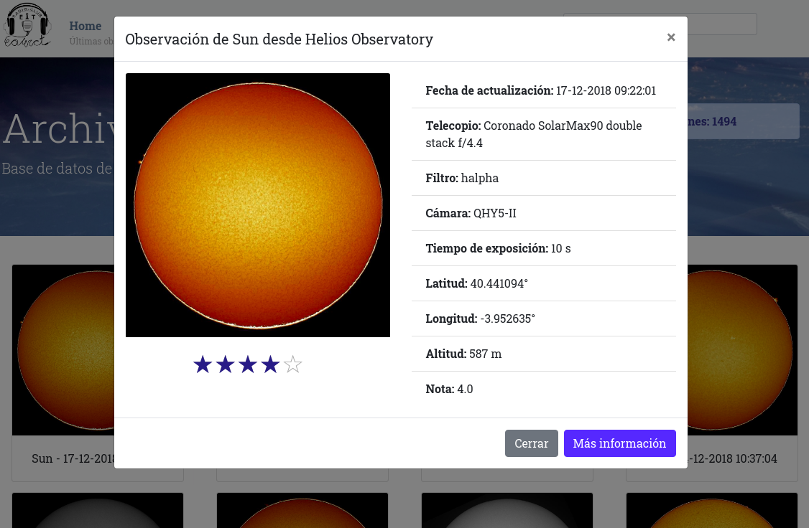

# Cesar Archive



Cesar Archive Viewer it's a web tool to navigate the data obtained in CESAR project. It's developed in `PHP` with `mySQL`, to filter and display the pictures obtained with the telescopes.

[ESAC Solar Observatory Helios](http://cesar.esa.int/index.php?Section=Observatories_ESAC_Sun) obtain pictures of the sun every day. They are proccessed and uploaded to Cesar Archive.

## Getting Started

### Prerequisites

Cesar Archive is built with **Docker**. In order to start the web application, you must have installed:

* [Docker](https://docs.docker.com/install/)
* [Docker-compose](https://docs.docker.com/compose/install/)

### Installing

To start Cosmos Archive just type in the root directory of the project:

```
$ docker-compose up -d
```

Then, it will deploy:
* **On port 80**: The Webserver application.
* **On port 8080**: PHPmyadmin connected to the database.
* **On port 3306**: MySQL database.

Then we have to import the `sample_database.sql` to MySQL. Run the following command:

```
$ docker exec -i cesar-archive-db bash -c 'mysql -u root sample_database --password=tiger < /home/sample_database.sql'
```

## Built With

* [Docker](https://www.docker.com/) - Contanier platform
* [Docker-compose](https://docs.docker.com/compose/) - Tool for defining and running multi-container Docker applications
* [Apache](https://httpd.apache.org/) - HTTP Server Project
* [PHP](https://php.net/)
* [MySQL](https://www.mysql.com/)
* [Bootstrap](https://getbootstrap.com/) - Frontend framework
* [npm](https://www.npmjs.com/) - Javascript package manager

## Authors

* **Fran Acién** - *Initial work* - [Github](https://github.com/acien101)

See also the list of contributors who participated in this project.

## License

This project is licensed under the MIT License - see the [LICENSE.md](LICENSE.md) file for details

## How it works

The whole project is configured by *Docker* in the **Dockerfile** on `./bin`.

Npm modules are installed when the container starts, saved on `/var/www/node_modules` inside the Docker machine. With Apache, modules are redirected on `localhost/dep/`. See [index.php](./www/index.php) for more information.
